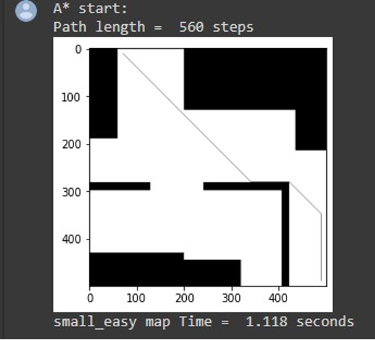
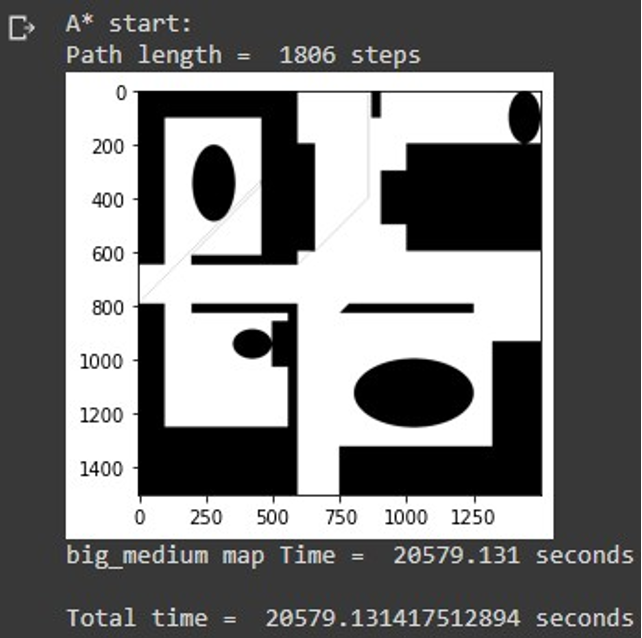

# AI Term Project: Path Planning and Global Coverage

## Path Planning

Algorithm: Weighted A\* Algorithm

- Search neighboring nodes in 8 directions (up, down, left, right, up-left, down-left, up-right, down-right)
- Simplify search area into quantifiable nodes
- Use Manhattan distance as the heuristic function h(n), weight = 10

### Process

1. Start with an open list containing the start node
2. Repeatedly:
   A. Find the node with the smallest F value in the open list
   B. Move this node to the closed list
   C. For each of its 8 neighboring nodes: - If unreachable or in the closed list, ignore - Else: - If not in the open list, add to open list, set current node as parent, record F, G, H values - If in the open list, check if the path through the current node is better (smaller G value). If so, set current node as parent and recalculate G and F values
3. Save the path by tracing back from the goal to the start through parent nodes

Note: Weighted A\* may trade off optimality for search speed. Different weights can affect the planned path.

### Results

- Small_easy: 560 steps, 1.118 seconds
- 
- Small_medium: 654 steps, 1.319 seconds
- 
- Small_hard: 624 steps, 159.095 seconds
- 
- Medium_easy: 986 steps, 95.76 seconds
- 
- Medium_medium: 1686 steps, 3300 seconds
- 
- Medium_hard: 1162 steps, 2171 seconds
- 
- Big_easy: 1868 steps, 15792 seconds
- 
- Big_medium: 1806 steps, 20579 seconds
- 
- Big_hard: 1976 steps, 5961 seconds
- 

For some maps, the search time was long due to the trade-off in Weighted A\*. Choosing the right weight is important to balance optimality and search speed.

## Global Coverage

Algorithm: DARP (Divide Areas Algorithm for Optimal Multi-Robot Coverage Path Planning)

- Divide the map into equal areas for each robot
- Ensure complete coverage, non-backtracking solution, minimum coverage path
- Use Minimum Spanning Tree Coverage (MSTC) algorithm for each robot's optimal path

### Advantages

- Convergence guarantee of coordinate descent optimization
- Fast optimization procedure
- Simple implementation

### Disadvantages

- Spatial connectivity of divided areas not guaranteed
- Fails if nodes are unreachable (e.g., surrounded by obstacles)

### Results

- Small_easy: 279 seconds, 100% coverage
- 
- Small_medium: 272 seconds, 100% coverage
- 
- Medium_easy: 2406 seconds, 100% coverage
- 
- Medium_hard: 3120 seconds, 100% coverage
- 

-Mutiple robots
- 

Small_hard, medium_medium, big_easy, big_medium, and big_hard failed due to corners that could not be covered by the minimum spanning tree approach. However, a multiple robot function was implemented to achieve 100% coverage faster than a single robot.

Note: The output colors may differ from the original map due to the color definition in matplotlib.imshow. White regions represent obstacles, black areas show the coverage of the first robot from the start, and orange areas show the coverage of the second robot from the goal.
